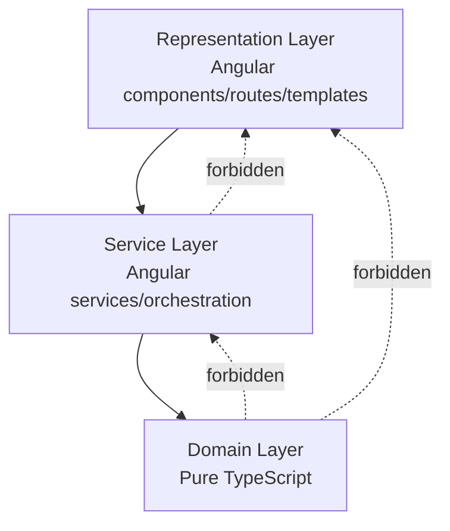
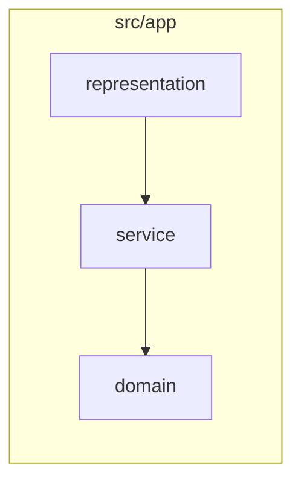

# Architecture and Data Semantics

Status: Draft

## Summary

This document defines the required implementation architecture for Home Floor Planner. The application uses strict layer separation across domain, service, and representation, aligned with repository structure, testing strategy, and architecture linting.

## Layer model

The codebase is separated into three layers:

- Domain layer: pure TypeScript business/domain logic with no Angular dependencies.
- Service layer: Angular service orchestration that composes domain logic and infrastructure concerns.
- Representation layer: Angular UI (components, routes, templates) with no business logic.

Layer rules:

- Representation may depend on service and domain types, but not domain implementations.
- Service may depend on domain.
- Domain must not depend on service or representation.
- Domain must remain as independent as possible from external dependencies.
- Service should use Angular capabilities first and avoid unnecessary third-party dependencies.
- Representation should primarily use Angular Material components for UI controls and layout primitives.

## Required file structure

Implementation must reflect layers in folder structure:

- `src/app/domain/`
- `src/app/service/`
- `src/app/representation/`

Suggested structure:

- `src/app/domain/`
  - `entities/`
  - `value-objects/`
  - `policies/`
  - `use-cases/` (pure TypeScript only)
- `src/app/service/`
  - `application-services/`
  - `persistence-services/`
  - `import-export-services/`
- `src/app/representation/`
  - `shell/`
  - `features/`
  - `shared-ui/`

## Testing and architecture enforcement

- Unit testing focus:
  - Domain layer: high coverage for business rules and transformations.
  - Service layer: high coverage for orchestration, validation, and data flow.
- E2E testing focus:
  - Representation workflows and accessibility behaviors.
  - Cross-layer user flows (property selection, editing, import/export).
- Architecture linting:
  - Use ArchUnitTS to enforce layer boundaries and dependency direction.
  - Failing architecture rules must block submission until fixed.

## Readability and dependency constraints

- Readability is a primary quality objective.
- Keep functions/classes small and intention-revealing.
- Prefer explicit names over clever abstractions.
- Avoid hidden side effects across layers.
- Keep domain APIs deterministic and testable.

## Domain semantics and constraints

- The product is a static website with no backend.
- One JSON object represents one property.
- Exactly one property is active at a time.
- Built-in bundled property files may be loaded as the active property.
- Coordinates are centimeters.
- Property origin is fixed at bottom-left `(0,0)`.
- Child coordinates are relative to the immediate parent.
- Walls/doors/openings are lines in current version.
- Wall and door lines require a rectangle parent context.

## UI and orchestration constraints

- Drawer and canvas are display/selection surfaces.
- Value editing is done through dedicated input fields.
- Snapping is deferred in current version.
- Rotation is out of scope for current version.

## Open questions (optional)

- Add unresolved architecture questions only.
- Remove each question after applying the decided behavior to specs.

## Links

- [specs/README.md](./README.md)
- [specs/product.md](./product.md)
- [specs/features/layout-data-drawer.md](./features/layout-data-drawer.md)
- [specs/features/accessible-layout-editor.md](./features/accessible-layout-editor.md)
- [specs/features/import-export-and-local-persistence.md](./features/import-export-and-local-persistence.md)
- [specs/features/application-layout-and-property-selection.md](./features/application-layout-and-property-selection.md)
- [specs/features/first-time-user-guidance.md](./features/first-time-user-guidance.md)
- [specs/decisions/layered-architecture-boundaries.md](./decisions/layered-architecture-boundaries.md)
